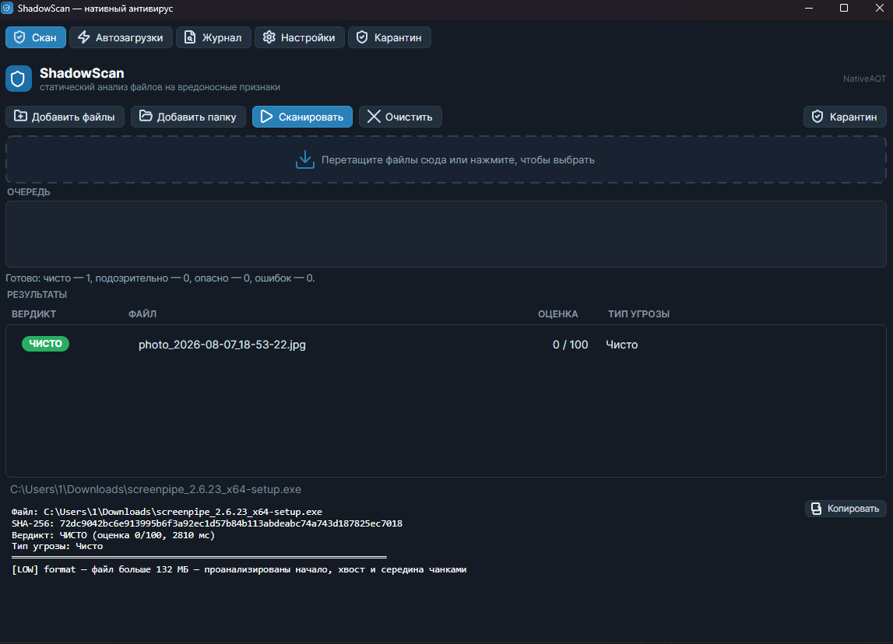
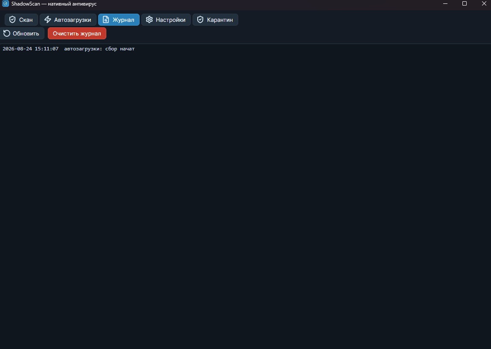
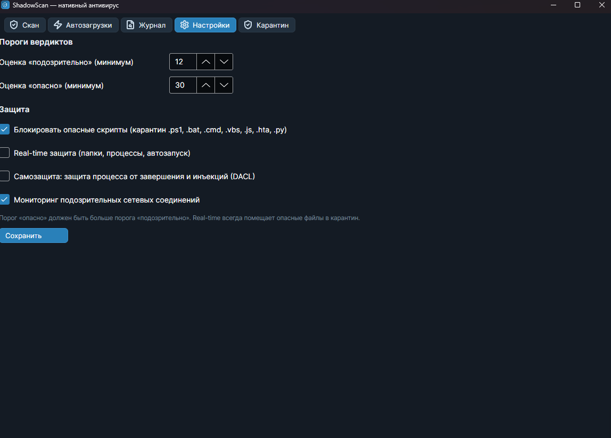
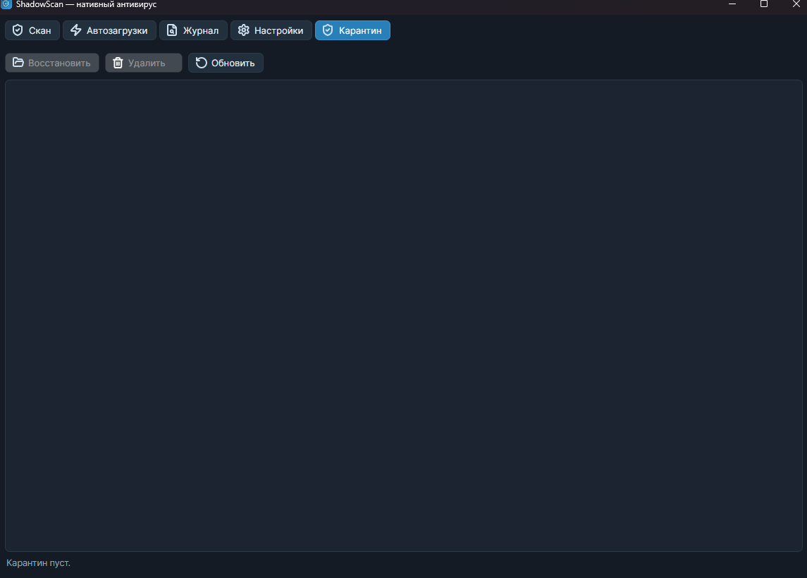

# 🛡️ ShadowScan

**Офлайн-антивирус статического анализа** — standalone exe на C# .NET 8 NativeAOT + Avalonia 11.2.5 (~75 МБ), не требует установки и подключения к интернету.

---

## 📸 Скриншоты

### Скан


### Журнал


### Настройки


### Карантин


---

## ✨ Возможности

- 🔍 **Многоуровневый движок** — YARA-правила + эвристики (энтропия, паттерны, scoring)
- 🦀 **Rust-модуль shadow_engine** — независимая оценка (энтропия + маркеры, скор 0-100) для подтверждения YARA
- 🛡️ **Real-time защита** — мониторинг DACL, сети, автоочистка
- 📂 **Автозагрузки** — уровень Autoruns (Run/RunOnce, Services, Drivers, Tasks, Winlogon, AppInit, BootExecute) с отключением без удаления
- 🔓 **Деобфускатор** — Base64, XOR, реверс строк
- 🖥️ **CLI-интерфейс** — `ShadowScan.exe --scan файлы...` с выводом JSON
- 📦 **Вшитые ресурсы** — yr.exe, rules.yarx, signatures.json распаковываются при запуске
- 📊 **36 string-правил** — детекты njRAT, DarkComet, Gh0st, XWorm, AsyncRAT и других семейств

---

## 🏗️ Архитектура

| Файл | Описание |
|:-----|:---------|
| `ScannerCore.cs` | Основной движок сканирования (~1700 строк): YARA, эвристики, scoring |
| `shadow_engine/` | Rust-модуль: независимый анализ энтропии и маркеров |
| `RtProtection.cs` | Real-time защита: DACL-урезание, мониторинг сети, автоочистка |
| `AutorunsManager.cs` | Управление автозагрузкой: чтение, отключение, включение |
| `Deobfuscator.cs` | Базовый деобфускатор: Base64, XOR, reverse strings |
| `signatures.json` | 36 string-правил для детекта семейств малвари |
| `rules.yarx` | YARA-правила (вшитый ресурс) |
| `yr.exe` | YARA-сканер CLI (вшитый ресурс) |

---

## 📦 Сборка

```bash
# Требуется .NET 8 SDK и Rust toolchain
dotnet publish -c Release -r win-x64 --self-contained `
  -p:PublishAot=true -p:AssemblyName=ss_core
```

Результат — standalone `ss_core.exe` (~75 МБ) без зависимостей.

---

## 🚀 Использование

### GUI

Запустите `ShadowScan.exe` — открывается окно с вкладками:

| Вкладка | Назначение |
|:--------|:-----------|
| **Скан** | Выбор файлов/папок, запуск анализа, отчёт |
| **Автозагрузки** | Просмотр и отключение записей автозагрузки |
| **Журнал** | История детектов с фильтрацией |
| **Настройки** | Пороги эвристики, поведение real-time |

### CLI

```bash
# Сканирование одного файла
ShadowScan.exe --scan myfile.exe

# Сканирование нескольких файлов
ShadowScan.exe --scan file1.exe file2.dll folder/

# Вывод — JSON
```

```json
{
  "file": "malware_sample.exe",
  "threat": "njRAT",
  "score": 87,
  "engine": "yara+heuristic",
  "details": "Detected string rule: njRAT"
}
```

---

## 📊 Семейства малвари

| Семейство | Тип | Статус |
|:----------|:----|:-------|
| njRAT | RAT | ✅ Детект |
| DarkComet | RAT | ✅ Детект |
| Gh0st | RAT | ✅ Детект |
| XWorm | RAT | ✅ Детект |
| AsyncRAT | RAT | ✅ Детект |
| Remcos | RAT | ✅ Детект |
| FormBook | Stealer | ✅ Детект |
| AgentTesla | Stealer | ✅ Детект |
| LokiBot | Stealer | ✅ Детект |
| HawkEye | Stealer | ✅ Детект |
| GuLoader | Dropper | ✅ Детект |
| DarkGate | Loader | ✅ Детект |
| WhiteSnake | Stealer | ✅ Детект |
| Zeus | Banker | ✅ Детект |
| TrickBot | Banker | ✅ Детект |
| AZORult | Stealer | ✅ Детект |
| Fareit | Stealer | ✅ Детект |
| Kovter | Trojan | ✅ Детект |
| Dyre | Banker | ✅ Детект |
| Discord | Stealer | ✅ Детект |
| Lumma | Stealer | ✅ Детект |
| SystemBC | Proxy | ✅ Детект |
| AMSI-bypass | Evasion | ✅ Детект |
| banker-webinject | Banker | ✅ Детект |

**Итого: 36 строковых правил** в `signatures.json`.

---

## ⚙️ Требования

| Компонент | Минимум |
|:----------|:--------|
| ОС | Windows 10/11 x64 |
| .NET SDK | 8.0 (для сборки) |
| Rust toolchain | stable (для shadow_engine) |
| Диск | ~75 МБ (standalone exe) |
| RAM | ~100 МБ (при сканировании) |

---

## 📜 Лицензия

MIT License. Проект является оборонительным инструментом статического анализа и **не предназначен для атак**.

---

<br/>

---

# 🛡️ ShadowScan

**Offline static-analysis antivirus** — standalone exe built with C# .NET 8 NativeAOT + Avalonia 11.2.5 (~75 MB), no installation or internet connection required.

---

## 📸 Screenshots

### Scan


### Detection Log


### Settings


### Quarantine


---

## ✨ Features

- 🔍 **Multi-layer engine** — YARA rules + heuristics (entropy, patterns, scoring)
- 🦀 **Rust shadow_engine** — independent scoring (entropy + markers, score 0-100) to cross-validate YARA
- 🛡️ **Real-time protection** — DACL monitoring, network monitoring, auto-remediation
- 📂 **Autoruns manager** — full Autoruns coverage (Run/RunOnce, Services, Drivers, Tasks, Winlogon, AppInit, BootExecute) with disable/enable (no deletion)
- 🔓 **Deobfuscator** — Base64, XOR, string reversal
- 🖥️ **CLI interface** — `ShadowScan.exe --scan files...` with JSON output
- 📦 **Embedded resources** — yr.exe, rules.yarx, signatures.json extracted on first run
- 📊 **36 string rules** — detections for njRAT, DarkComet, Gh0st, XWorm, AsyncRAT and more

---

## 🏗️ Architecture

| File | Description |
|:-----|:------------|
| `ScannerCore.cs` | Main scanning engine (~1700 LOC): YARA, heuristics, scoring |
| `shadow_engine/` | Rust module: independent entropy and marker analysis |
| `RtProtection.cs` | Real-time protection: DACL trimming, network monitoring, auto-remediation |
| `AutorunsManager.cs` | Autoruns management: read, disable, enable |
| `Deobfuscator.cs` | Basic deobfuscator: Base64, XOR, reverse strings |
| `signatures.json` | 36 string rules for malware family detection |
| `rules.yarx` | YARA rules (embedded resource) |
| `yr.exe` | YARA scanner CLI (embedded resource) |

---

## 📦 Building

```bash
# Requires .NET 8 SDK and Rust toolchain
dotnet publish -c Release -r win-x64 --self-contained `
  -p:PublishAot=true -p:AssemblyName=ss_core
```

Output: standalone `ss_core.exe` (~75 MB) with zero dependencies.

---

## 🚀 Usage

### GUI

Launch `ShadowScan.exe` — a window opens with the following tabs:

| Tab | Purpose |
|:----|:--------|
| **Scan** | Select files/folders, run analysis, view report |
| **Autoruns** | View and disable autorun entries |
| **Journal** | Detection history with filtering |
| **Settings** | Heuristic thresholds, real-time behavior |

### CLI

```bash
# Scan a single file
ShadowScan.exe --scan myfile.exe

# Scan multiple files
ShadowScan.exe --scan file1.exe file2.dll folder/

# Output is JSON
```

```json
{
  "file": "malware_sample.exe",
  "threat": "njRAT",
  "score": 87,
  "engine": "yara+heuristic",
  "details": "Detected string rule: njRAT"
}
```

---

## 📊 Malware Families

| Family | Type | Status |
|:-------|:-----|:-------|
| njRAT | RAT | ✅ Detected |
| DarkComet | RAT | ✅ Detected |
| Gh0st | RAT | ✅ Detected |
| XWorm | RAT | ✅ Detected |
| AsyncRAT | RAT | ✅ Detected |
| Remcos | RAT | ✅ Detected |
| FormBook | Stealer | ✅ Detected |
| AgentTesla | Stealer | ✅ Detected |
| LokiBot | Stealer | ✅ Detected |
| HawkEye | Stealer | ✅ Detected |
| GuLoader | Dropper | ✅ Detected |
| DarkGate | Loader | ✅ Detected |
| WhiteSnake | Stealer | ✅ Detected |
| Zeus | Banker | ✅ Detected |
| TrickBot | Banker | ✅ Detected |
| AZORult | Stealer | ✅ Detected |
| Fareit | Stealer | ✅ Detected |
| Kovter | Trojan | ✅ Detected |
| Dyre | Banker | ✅ Detected |
| Discord | Stealer | ✅ Detected |
| Lumma | Stealer | ✅ Detected |
| SystemBC | Proxy | ✅ Detected |
| AMSI-bypass | Evasion | ✅ Detected |
| banker-webinject | Banker | ✅ Detected |

**Total: 36 string rules** in `signatures.json`.

---

## ⚙️ Requirements

| Component | Minimum |
|:----------|:--------|
| OS | Windows 10/11 x64 |
| .NET SDK | 8.0 (for building) |
| Rust toolchain | stable (for shadow_engine) |
| Disk | ~75 MB (standalone exe) |
| RAM | ~100 MB (during scan) |

---

## 📜 License

MIT License. This project is a defensive static analysis tool and is **not intended for offensive use**.
